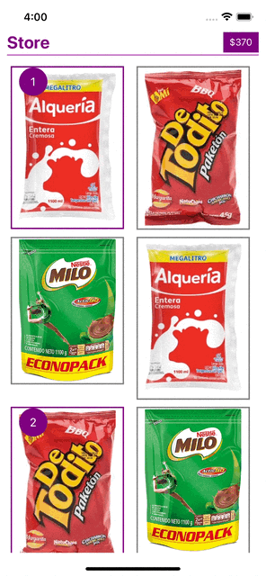

# ChallengeProject App

This is Jose Alejandro Vera challenge project app. It is an ios app.

## Getting Started

These instructions will get you a copy of the project up and running on your local machine for development and testing purposes.

### Prerequisites

To run the project locally you need this:

- [NodeJS](https://nodejs.org/en/) now using v18.16.1
- [Xcode](https://apps.apple.com/us/app/xcode/id497799835?mt=12)
- [CocoaPods with homebrew](https://formulae.brew.sh/formula/cocoapods) Now using v 1.12.1
- Xcode >= 14.0 ( Required MacOs >= 12.6)

## Installation

Install Node dependencies.

```bash
npm install
```

## iOS

For iOS: Install pods dependencies into the `ios` folder.

```bash
cd ios
pod install
```

If the pod install step fails, it may be related to no default xcode in the computer, try running this command:

```bash
sudo xcode-select --switch /Applications/Xcode.app
```

#### Scripts available

To run iOS app you can use some of the following scripts:

```bash
npm run ios
```

To run tests

```bash
npm run test
```

## Sample Usability Gifs



